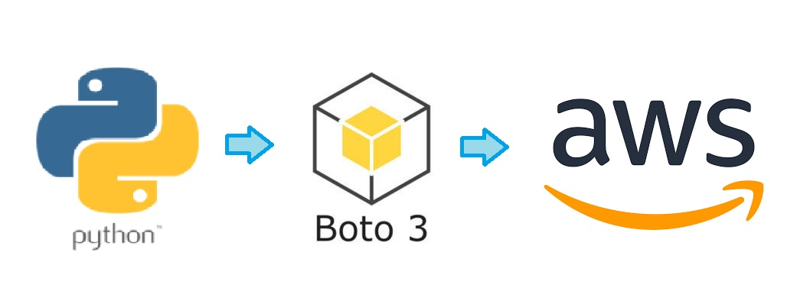

<h1 align="center">python-aws-boto3</h1>

## Table of Contents
1. [General Info](#General-Info)
2. [Boto3 SDK](#Boto3-SDK)
3. [Use case 1 - Communication with S3](#Use-case-1---Communication-with-S3)
4. [Use case 2 - Load data into DynamoDB](#Use-case-2---Load-data-into-DynamoDB)
5. [Faker](#Faker)
    * [Generating CSV](#Generating-CSV)
    * [Generating JSON](#Generating-JSON)
6. [Use case 3 - Querying data in DynamoDB](#Use-case-3---Querying-data-in-DynamoDB)
    * [Full scan](#Full-Scan)
7. [Use case 4 - From S3 To DynamoDB](#Use-case-4---From-S3-To-DynamoDB)
    * [S3Select](#S3Select)
    * [De S3 a DynamoDB](#De-S3-a-DynamoDB)

### General Info
***
Integrating Python, AWS, and Boto3 allows developers to easily automate various tasks, including working with AWS services like S3 and DynamoDB. With Boto3, developers can write Python code to create, configure, and manage AWS resources like EC2 instances, RDS databases, and more. Additionally, Boto3 makes it easy to work with AWS services like S3 and DynamoDB, allowing developers to perform tasks like uploading files to S3 and querying data in DynamoDB directly from Python code. Overall, integrating Python, AWS, and Boto3 is a powerful way to streamline workflows and increase productivity when working with AWS.

In this project, we will learn how to integrate Python with AWS S3 and DynamoDB services using the Boto3 library. Boto3 will allow us to establish a connection with AWS to perform various operations, such as uploading and downloading files from S3 or adding and querying data in DynamoDB. Additionally, we will use the Faker library to generate fake data, which will enable us to quickly create large amounts of test information for our applications.

To authenticate ourselves to AWS from our local system, remember that you need to copy the access credentials to ~/.aws/credentials or set them using environment variables.

This project has been carried out following the <a href="https://aitor-medrano.github.io/bigdata2122/apuntes/ingesta05python.html#referencias">tutorial</a> by Aitor Medrano

## Boto3 SDK
***
The <a href="PythonAWSBoto3.ipynb">PythonAWSBoto3.ipynb</a> file contains clear examples of how to create, access, read, and delete user buckets using resources and clients.

## Use case 1 - Communication with S3
***
The file <a href="Use case 1 - Communication with S3.ipynb">Use case 1 - Communication with S3.ipynb</a> contains specific examples of how to upload files to an S3 bucket. It demonstrates two methods: using a S3 resource and the upload_file() and put() functions, and using an S3 client and the upload_file() and upload_fileobj() functions. The file also demonstrates how to download files using the download_file() and download_fileobj() functions.

## Use case 2 - Load data into DynamoDB
***
The <a href="Use case 2 - Load data into DynamoDB.ipynb">Use case 2 - Load data into DynamoDB.ipynb</a> file contains examples of how to use DynamoDB. It shows how to create a table in DynamoDB and insert data by reading it from the <a href="data/FilmsData.json">FilmsData.json</a> file.

## Faker
***
The file <a href="How to use the Faker library.ipynb">How to use the Faker library.ipynb</a> contains examples of how to work with Python's Faker library to generate fake data and use it in projects. Additionally, the file demonstrates how to export this data to popular formats such as CSV and JSON.

#### Generating CSV
***
Generating a CSV file with fake data from 1000 people.

#### Generating JSON
***
Generating a JSON file with fake data from 1000 people.

## Use case 3 - Querying data in DynamoDB
***
The file <a href="Use case 3 - Querying data in DynamoDB.ipynb">Use case 3 - Querying data in DynamoDB.ipynb</a> contains examples of queries made in DynamoDB using the DynamoDB API, which is a programming interface that allows interaction with the DynamoDB database programmatically. Additionally, queries using PartiQL are also used, which is a flexible query language that allows querying data in both NoSQL and relational databases.

#### Full Scan
***
When using PartiQL, if we do not specify an expression in the condition that searches for one of the keys, a full scan will be performed on the entire table, which can imply unexpected costs both economically and in terms of provisioned performance.
## Use case 4 - From S3 To DynamoDB
***
The file <a href="Use case 4 - From S3 To DynamoDB.ipynb">Use case 4 - From S3 To DynamoDB.ipynb</a> shows a practical example of how to read a CSV file stored in an Amazon S3 bucket and insert the corresponding data into a table in DynamoDB.

#### S3Select
***
A SQL query is executed from Python to automate the ETL process using S3Select to retrieve a subset of the data.
#### De S3 a DynamoDB
***
The data is loaded from S3 into DynamoDB.

